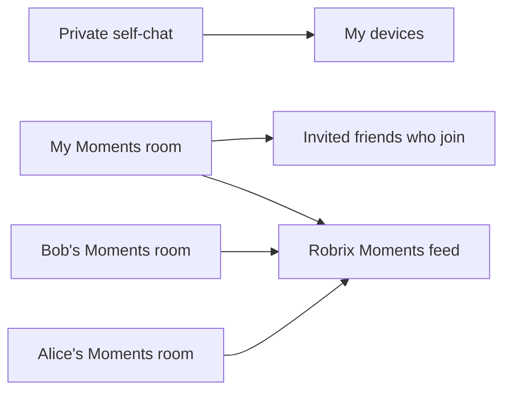

# ADR 0001: Moments on Matrix with a separate private self-chat

- Status: Accepted; first native slice implemented. Full visual and physical-device acceptance remains open.
- Date: 2026-09-20
- Scope: The user authorized implementation on 2026-09-20. The first native
  slice follows this decision; see [implementation and evidence](../../lab/wechat-ux/MOMENTS.md).
- Related: [production scope](../../lab/wechat-ux/SCOPE.md),
  [joined Spaces](../../lab/wechat-ux/JOINED-SPACES.md),
  [chat actions and forwarding](../../lab/wechat-ux/CHAT-ACTIONS-FORWARDING.md).

## Context

The requested experience is WeChat Moments (朋友圈): publish personal posts,
view friends' posts in a combined feed, and comment or like. Users must also
retain private self-messaging for notes and file transfer between devices.

Matrix's room timeline is communication history, not a built-in personal
social profile. Spaces organize rooms. This proposal adds Robrix presentation
and conventions on top of normal Matrix transport; it does not turn a Space
or an existing self-DM into a social feed.

At proposal time the app had four mobile tabs, shared media handling, encrypted
room messaging, replies, reactions, and forwarding. The implementation adds a
dedicated Moments module and exposes private File Transfer separately.

## Decision

Create a dedicated, private, encrypted Moments room for each publishing user.
Use explicit invitations for its audience and aggregate accessible Moments
rooms into a local feed. Keep self-chat in a different room with a different
purpose and membership. The first version has one audience per author's
timeline, not a different audience per post.

| Surface | Role | Intended audience |
| --- | --- | --- |
| Chats → File Transfer | Existing or newly created self-chat for files and notes | This account and its devices |
| Me → My Posts | Publish and manage the author's Moments room | Author and explicitly admitted viewers |
| Discover → Moments | Combine accessible posting rooms | Only posts this account can access |
| Contact details → Moments | Filter the feed to that author's room | Subject to the same access rules |
| Chats → Spaces | Organize conversation rooms | Existing Space behavior |

Self-chat has no automatic publishing path. **Post to Moments** must be a
separate user action with a composer and audience summary. Never reuse a
self-chat room ID, invite friends into it, or migrate its history into Moments.
When an existing self-chat has additional members or pending invitations, do
not silently label it a private File Transfer room; offer a separate private
room without modifying the old conversation.

## Room identity, creation, and discovery

- Immutable creation type: `rs.robius.robrix.moments` (not `m.space`).
  Use a room version supported by the existing SDK and homeserver.
- Derive the posting owner from the authenticated original room-creation
  event's sender. A name, avatar, alias, or content-supplied author ID cannot
  establish ownership. Ownership transfer is outside version 1.
- Configure invitation-only access, encryption, `joined` history visibility,
  and no public-directory publication before sending the first post.
- Only the owner manages invitations, removals, and room configuration.
  Inviting someone to a Space or opening a DM must not add them to this room.
- Use account data under a Robrix namespace to remember the author's chosen
  room ID and feed preferences. Treat it as discovery/preferences, not access
  control. Never store media keys or post bodies there.
- Discover followed timelines through accepted Moments-room invitations and
  joined memberships. A DM target is not automatically a friend or subscriber.
  Viewing Alice's timeline does not automatically grant Alice access to mine.
- Make creation recoverable: record an operation ID, reconcile a timeout
  against existing owned typed rooms, and reuse the chosen room across devices.
  If concurrent devices create two rooms, surface a choice; do not merge their
  audiences, delete a room, or move posts automatically.

Custom [room types](https://spec.matrix.org/v1.19/client-server-api/#types)
identify this use. They do not introduce new server-side authorization rules.

## Post and interaction contract

Version the Robrix extension independently from the Matrix room version. The
initial wire-format contract should be frozen with serialization fixtures in
the first implementation change, following the custom-content patterns in
[`mini_app.rs`](../../src/mini_app.rs) and
[`forwarding.rs`](../../src/forwarding.rs).

| Item | Representation and validation |
| --- | --- |
| Post | A root `m.room.message` with a versioned `rs.robius.robrix.moments` extension; accept as a post only when the event sender is the room's owner |
| Text/media | Standard text, image, or video content where applicable; media uploaded with the existing encrypted-attachment machinery |
| Album | One canonical post event referencing its ordered encrypted media assets; never infer an album from nearby timestamps or unrelated messages |
| Comment | A message with an `m.thread` relationship to a validated post in the same room; render its actual Matrix sender |
| Like | A `m.reaction` annotation on a validated post; count once per sender/key and handle removal |
| Edit | A valid same-author replacement of the original post/comment; keep the original event ID as identity |
| Delete | Redaction; suppress removed content without promising erasure of downloaded copies |

Include a readable body fallback and define behavior for unknown extension
versions. Other clients may show an ordinary message, expose the room as a
chat, or omit custom album details. Full Moments interoperability is not
claimed. Unknown content must not crash or become an executable mini-app.

The API mechanisms are [threads](https://spec.matrix.org/v1.19/client-server-api/#threading),
[reactions](https://spec.matrix.org/v1.19/client-server-api/#mreaction), and
[encrypted attachments](https://spec.matrix.org/v1.19/client-server-api/#sending-encrypted-attachments).
Standard reactions are normally unencrypted; version 1 must not describe likes
as having the same content confidentiality as encrypted posts or comments.

## Audience and privacy semantics

The composer must show **Timeline audience**, with the people currently able
to participate and any pending invitations. Joining the timeline is explicit.
Adding a viewer applies prospectively: version 1 does not offer a promise of
access to all earlier posts. Verify the selected history/key-sharing behavior
on real clients before presenting a precise history-access statement.

Members who can read a post can read its comments and see its likes. Audience
members can also discover other room members. This is an intentional limitation
relative to WeChat's mutual-friend-only interactions and less-visible social
graph. The first-use audience description must make it understandable.

Room access and the feed's authorship rules are distinct. Because posts and
comments share an encrypted transport event type, normal Matrix power levels
cannot enforce “this member may only send comments.” Robrix must validate
decrypted event authorship and relations; unauthorized root messages must not
be presented as the owner's posts. This is a client interpretation rule, not
a server-enforced prohibition on sending other content. [Permission model](https://spec.matrix.org/v1.19/client-server-api/#mroompower_levels)

Removing a viewer must stop future delivery of usable new content/keys after
the membership change is confirmed and the SDK rotates the sending session.
Previously received content cannot be recalled. Test this with retained old
keys and a second device; do not substitute a UI-hide assertion for that test.
Drafts and pending sends must recheck the audience after a membership change.

“Hide this author” only changes this viewer's feed. “Remove viewer” changes the
author's audience. Existing Matrix ignore/block behavior must not be described
as revoking read access to a Moments room.

Per-post inclusion/exclusion lists, private comments, mutual-friend filtering,
and public followers need a subsequent ADR. A JSON audience field or hiding a
post in the interface cannot protect content already delivered to room members.

## Client integration and lifecycle

- Recognize typed Moments rooms before routing them into ordinary chat lists,
  Contacts → Group Chats, joined Space trees, forwarding destination pickers,
  and chat unread totals. Add explicit Moments destinations where needed.
- Route a Moments-room invitation to a named timeline invitation, showing the
  owner and audience semantics before joining. Do not auto-join on sync.
- Maintain separate chat and Moments unread indicators. Do not let the ordinary
  chat notification path bypass Moments preferences or preview privacy.
- Use SDK sync/decryption and media storage. Aggregate locally, with per-room
  history cursors, bounded subscriptions, and lazy media/thumbnail downloads.
  Do not fetch every friend's full history to draw the first feed page.
- Deduplicate by `(room_id, event_id)`, reconcile local echoes with transaction
  IDs, and retry uncertain sends using the original ID. Persist pending work
  per account and never resend a confirmed post during a retry.
- Merge loaded posts newest first with stable tie-breaking. Display loading or
  incomplete-history states; a timestamp is presentation data, not ownership
  evidence or proof that all earlier posts have been loaded.
- Keep unavailable encrypted events as an unavailable-content state; retry when
  keys arrive. Recovery, account switching, logout, and cancellation must clear
  or isolate transient feed data and reject stale async responses.
- Preserve normal chat workflows. Hiding/deleting a chat, clearing local chat
  history, or clearing File Transfer must not publish, leave, or redact Moments.

Implementation touchpoints include [`sliding_sync.rs`](../../src/sliding_sync.rs),
[`rooms_list.rs`](../../src/home/rooms_list.rs),
[`joined_spaces.rs`](../../src/home/joined_spaces.rs),
[`mobile.rs`](../../src/home/mobile.rs), and a new dedicated Moments model/UI.
The posting composer must check that its destination is a validated Moments
room; the self-chat/File Transfer destination is never a substitute.

## Alternatives considered

| Alternative | Reason not selected for version 1 |
| --- | --- |
| Reuse the self-DM | Changes the audience of private notes/files and conflates saving with publishing |
| Post directly into a Space | Mixes room organization with posting and is poorly represented by normal clients |
| One shared room for everyone's Moments | Makes all authors share one audience and moderation boundary |
| One room for every post | Can support distinct audiences, but adds membership, invitation, key, and sync costs per post |
| Copy every post into each friend's DM | Pollutes chat, creates multiple identities for edits/comments, and fragments conversations |
| Separate social backend | Adds another identity, storage, authorization, and deployment system before it is needed |

The chosen design keeps a single authoritative post and reuses the current
Matrix account and infrastructure. Its cost is Robrix-specific feed logic and
a shared audience boundary for each author's posts. A small implementation
spike must verify typed-room behavior, custom content preservation, and SDK
encryption/notification behavior on Palpo and another compatible homeserver;
protocol availability alone is not evidence that these integrations work.

## Delivery and acceptance

1. **Contract and model:** creation/recovery, typed-room classification, account
   registry, content serialization, and validation. Establish fixtures before UI.
2. **Private utility:** expose File Transfer, reuse a suitable self-chat or create
   a separate encrypted room, and verify file exchange on two devices.
3. **Moments slice:** explicit timeline invitations, text and media posts, feed,
   personal/contact timelines, comments, likes, and owner moderation. An album
   is only complete once its serialization, uploads, rendering, and retry
   behavior work together.
4. **Live and UX validation:** native instrumented journeys using isolated test
   accounts, recipient-device decryption checks, restart/reconnect, and a visual
   comparison against the agreed WeChat references.

Required evidence must include:

- Sending a file to self reaches another device of the same account and never
  appears in any friend's feed; adding Moments viewers leaves self-chat
  membership, room ID, and history unchanged.
- An admitted friend receives/decrypts a post and can comment/like; a third
  account outside the audience cannot retrieve/decrypt its protected content.
- Later joiners, pending invitees, and removed viewers have the documented
  history and key access; leaving/ignoring/hiding are tested separately.
- Forged author fields, roots from non-owners, cross-room comment references,
  invalid replacements, unknown versions, and duplicate likes are handled.
- Updates and redactions converge on a second client; interrupted uploads and
  retry/restart do not duplicate posts or leak unencrypted media keys.
- Feed pagination stays responsive with many timelines; missing keys and
  incomplete loading are visible; account switching never shows another
  account's feed or draft.
- Navigation, draft preservation, ordinary group/DM workflows, File Transfer,
  and the Chats → Spaces switch remain usable on mobile and desktop layouts.

Functional success does not award the separate 9/10 visual-similarity gate.
Physical iOS testing and release claims require their own evidence. Automated
implementation checks use isolated fixture accounts, not a personal audience.

## Remaining design work

The [implementation contract](../../lab/wechat-ux/MOMENTS.md) specifies the
version-1 album payload/fallback, media/count limits, explicit invitation UX,
and feed indicators. A later ADR must choose the audience-storage model if
per-post privacy or WeChat-exact comment visibility becomes a requirement.

## References

- [Matrix synchronization](https://spec.matrix.org/v1.19/client-server-api/#syncing)
- [History visibility](https://spec.matrix.org/v1.19/client-server-api/#room-history-visibility)
- [Matrix Spaces](https://spec.matrix.org/v1.19/client-server-api/#spaces)
- [Circles source and project status](https://github.com/circles-project/circles-android):
  prior art for a social interface on Matrix; active development ended in 2024.
