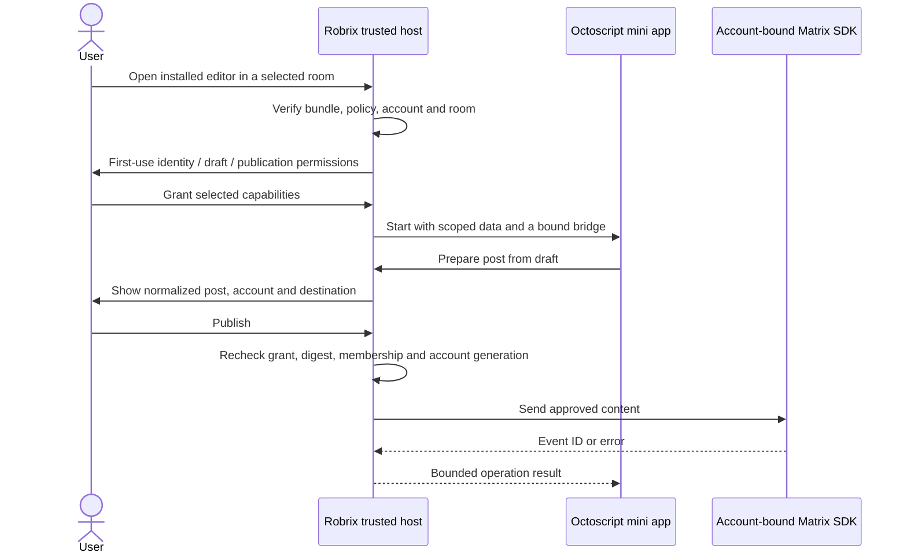

# ADR 0002: Octoscript mini apps and delegated Matrix authority

- Date: 2026-09-20
- Status: Proposed
- Implementation: source review and design only. The development branch includes
  the existing web mini apps, WeChat-style UI, Moments and Hagency work. It does
  not yet include a contained Octoscript host or a post-editor mini app.
- First application: a native Markdown/HTML post editor, opened from a chat or
  Discover → Mini Apps, with local drafts, preview and explicit publication.

## Decision

Keep the logged-in Matrix SDK client and all credentials in Robrix's trusted
Rust host. Give each admitted mini-app instance a bounded, revocable authority
record. A mini app calls specific host operations; the host performs the
authorized operation using the user's existing session.

An application can know which account it is acting for, if granted identity
access, without receiving that account's password, Matrix access/refresh token,
SSO provider tokens, cookies, recovery key or encryption keys. Login through
Google or GitHub does not grant an app access to those providers' credentials.

There are three independent checks: authenticate the installed app's bytes and
publisher; authenticate the user through Robrix's existing Matrix session; and
authorize this app instance to perform this particular operation. A publisher
signature does not substitute for the user's permission.

## What the OctoSense sources establish

Reviewed immutable revisions:

| Repository | Revision | Relevant implementation |
| --- | --- | --- |
| [octosense-rom](https://github.com/OctoSense-org/octosense-rom/tree/1e76b69f33e2ff55e688e7d5c6abf4024691838a) | `1e76b69f` | Platform-signed packages; privileged Binder service |
| [OctoSense](https://github.com/OctoSense-org/OctoSense/tree/fa0bc30242c914eae76eab2a396d904bc8ae2b46) | `fa0bc302` | Trusted native module hosting in separate script isolates |
| [OctoSense-mobile](https://github.com/OctoSense-org/OctoSense-mobile/tree/ea2b7a28f789d7994b9a6e57f6edddd9a7c74cf2) | `ea2b7a28` | ADRs 0001–0003 and signature-checked Android bridge |
| [OctoSense-App-Hub](https://github.com/OctoSense-org/OctoSense-App-Hub/tree/97c2a1fd9aa49a6b87586f228e070e0c16b1067b) | `97c2a1fd` | Manifest admission, policy resolution, signatures and Splash adapter |
| [Makepad policy merge](https://github.com/OctoSense-org/makepad/commit/7786bb4a32d3282197699eefd2f2e9defbcf2d53) | `7786bb4a` | Splash service/network checks, cumulative instructions and heap limit APIs |
| [Octoscript](https://github.com/OctoSense-org/Octoscript/tree/86a51a30767da5bf1f2e87559730f8539300b5d0) | `86a51a30` | Restricted language, L0/L1 admission, capability runtime and secret adapters |

### ROM authority is separate from app authority

The ROM's [AgentPlatformService](https://github.com/OctoSense-org/octosense-rom/blob/1e76b69f33e2ff55e688e7d5c6abf4024691838a/vendor/octosense/agent/src/dev/makepad/octosense/agent/AgentPlatformService.java)
checks the Binder caller's platform signature and package allowlist, with
explicit same-UID/system exemptions. Its manifest also requires a signature
permission to bind. That protects privileged Android services; it does not
authenticate individual scripts inside a permitted process. Robrix mini apps
must not inherit screen capture, input injection or other ROM powers.

OctoSense's [module host](https://github.com/OctoSense-org/OctoSense/blob/fa0bc30242c914eae76eab2a396d904bc8ae2b46/src/module_host.rs)
invokes linked native modules through trusted VM entry points. Such a module
shares the process's native authority even when its UI has its own script heap.
Keep dynamically installed native plugins outside the mini-app design.

### Reuse app admission and enforcement, with explicit Robrix extensions

The [policy resolver](https://github.com/OctoSense-org/OctoSense-App-Hub/blob/97c2a1fd9aa49a6b87586f228e070e0c16b1067b/crates/app-policy/src/policy.rs)
rejects unknown capabilities, restricts agent tools and clamps resource requests
to host ceilings. One policy produces both the isolate configuration and an
optional agent profile. The hub separately verifies publisher manifests and
anchor-certified catalog signatures. These signatures establish admitted bytes
and update continuity; they do not prove that arbitrary code is harmless.

The [Splash adapter](https://github.com/OctoSense-org/OctoSense-App-Hub/blob/97c2a1fd9aa49a6b87586f228e070e0c16b1067b/crates/app-policy/src/splash_adapter.rs)
sets storage, capabilities, prompt rights, network hosts and compute limits
before evaluation. The [runtime policy](https://github.com/OctoSense-org/makepad/blob/7786bb4a32d3282197699eefd2f2e9defbcf2d53/widgets/src/splash_policy.rs)
checks service names and network destinations per script heap. An unpoliced
heap retains legacy behavior, so Robrix must refuse to launch an imported app
unless policy installation succeeds. Grants to a capability family cover its
services; prefer exact operation grants to a broad `matrix` grant.

The mobile security ADR still describes these runtime changes as uncommitted.
Source verification found them in published merge `7786bb4a`, also referenced
by App-Hub's optional Makepad dependency. This corrects that stale status but
does not establish compatibility with Robrix's current `47837267` pin.

Network review must cover direct requests, artwork/resource loading, redirects
and native data helpers. The Splash policy matches host or host:port; it is not
the same as Octoscript's stricter endpoint/origin catalog. Start the editor with
no network grant and bundled assets. A host allowlist alone cannot prevent an
app from sending data to an allowed destination.

The upstream app-policy capability catalog currently lacks Matrix operations.
Adding the operations below requires a versioned Robrix extension, matching
broker implementations and negative tests. It is not achieved by putting new
strings into an otherwise unmodified upstream manifest.

### Hardened Octoscript does not automatically harden every Splash host

Octoscript's [security model](https://github.com/OctoSense-org/Octoscript/blob/86a51a30767da5bf1f2e87559730f8539300b5d0/SECURITY.md)
removes ambient OS APIs from its runtime and mediates tool calls. It explicitly
separates the language boundary from containment of native adapters. Its script
heap limit is not a process-wide memory quota, and its hardening does not alter
a host embedding a different raw Makepad VM.

Use the VM-independent `octoscript-ui-l0` checker and realization first. Pin the
UI source, trusted kit, capability bindings and runtime in admission. Execute
only host-reviewed kit/renderer code behind that profile. Imported arbitrary
Splash source is a separate compatibility mode and stays disabled until its
complete host surface is reconciled and tested. Host calls and native widgets
remain part of the trusted computing base.

## Launch and authentication contract

At creation, bind the actual VM/heap and host channel to:

`account + login_generation + publisher/app_id + version/content_digest + instance_id`

The host-owned record additionally holds allowed operations, selected room or
timeline, policy generation, expiry, budgets and revocation state. It is not
serialized into a bundle. The app cannot choose these bindings in a JSON call.
An exposed correlation ID is not a bearer credential: the host always derives
the caller from the VM/channel, then checks its record. Never trust an app-sent
`user_id`, `app_id`, room ID or session ID as authority.

Keep the exact account-bound SDK client with the host context. Do not fetch
"whichever client is current" after awaiting a dialog or network operation.
Logout, account switch, app removal, version change, expiry and revocation
invalidate the instance's grants and queued work. Recheck room membership,
power levels and current policy immediately before dispatching an effect.
Revocation cannot undo a request already accepted by the homeserver; record its
outcome and never silently replay an uncertain send under a new account.

Identity responses contain only granted fields, such as Matrix user ID, display
name and avatar reference. Render identity in trusted host chrome when the app
does not need to receive it. The editor needs no room-history read permission.

## Authentication when another user receives the app

Sharing an app distributes its identity and code, never the sender's login,
permission grants, app-backend session or private drafts. Every recipient must
establish their own authenticated context before the app receives account
access. Being in the same Matrix room, decrypting the card, or trusting its
sender does not grant the app any authority. The sender may also be different
from the app's publisher.

The first-use flow is **received card → verified details → Continue with Robrix
→ recipient consent → optional backend sign-in → open**. Robrix owns the
account and permission screens outside the mini-app isolate.

| Stage | Required behavior |
| --- | --- |
| Receive | Render bounded metadata only. Do not execute the app, contact its backend or request an identity proof. |
| Inspect | On the user's Open action, verify the package, publisher, exact version/digest and admission status. Show the app's permissions and any backend receiving identity. Refuse unadmitted or withdrawn packages. |
| Authenticate recipient | If signed out or the Matrix session requires reauthentication, use Robrix's normal password/SSO flow. Otherwise show the existing account as **Continue as @bob:example.org**, with an account-switch option. A valid Matrix login can be reused without asking for the password again. |
| Authorize app | Show the recipient the requested operations and selected destination. Only explicit consent grants account access. Denial leaves the app without those capabilities; receipt or installation is not consent. |
| Authenticate backend, if needed | After consent, perform the declared service's identity exchange through the host. Bind the result to this recipient and app. An offline editor skips this stage. |
| Launch | Create a new recipient-bound instance and scoped storage. Configure the policy and bridge before evaluating source. Publishing still requires the separate final content/destination confirmation. |

Example trusted consent sheet for the post editor:

> **Post Editor — published by OctoSense**
>
> Continue as **@bob:example.org**
>
> Requested access: display name; this app's drafts; request publication to
> **Design Group** after you confirm each post.
>
> **Cancel** / **Allow and open**

The publisher label comes from verified admission metadata, and the account,
destination and permission descriptions come from Robrix. They must not come
from an app-rendered imitation of the consent sheet. Show identity disclosure
to an external service separately. Translate the host flow through the existing
English/Chinese catalogs; for example, **使用 Robrix 继续** and **允许并打开**.

Remembered consent is local to the recipient account, installation and approved
policy. Later opens create fresh instance grants only while that consent,
account session, version/admission and destination scope remain valid. New
permissions require new consent. Account changes or a new device require their
own authentication and local consent; the sender's approval cannot satisfy
either. Removal or revocation also clears the corresponding backend session.

For example, Alice sends Bob the editor. Bob opens his own instance, sees his
own drafts, and publishes as Bob to a destination he approves. He cannot see
Alice's private drafts or publish as Alice. Sharing a particular document or
collaborative workspace requires an additional invitation/access-control check;
a mini-app card is not a document-access grant.

### A backend verifies the recipient independently

The app backend must not accept a Matrix user ID supplied in a launch URL or
JSON object as proof of login. A proposed host-mediated exchange is:

1. Robrix selects the backend registered for the admitted app. It starts a
   short-lived login transaction bound to the app, destination service and
   recipient instance; arbitrary destinations from a chat card are rejected.
2. After recipient consent, Robrix requests an OpenID proof from that user's
   Matrix homeserver using the host-owned Matrix session. It transmits the
   proof only to the approved backend over authenticated HTTPS.
3. The backend validates the proof with the indicated homeserver's OpenID
   userinfo API using validated Matrix server discovery. Its verifier must
   defend against attacker-selected discovery destinations and redirects. The
   verified `sub`, not a client-supplied account name, identifies the user. The
   host checks that it matches the account bound to the pending transaction.
4. The backend consumes its login transaction once and issues its own limited
   app session. Robrix binds and stores that session on the host side; the
   isolate receives only the authorized bridge and necessary non-secret data.
   Refresh, logout and revocation belong to this recipient's session.

These are proposed application-protocol steps, not a new Matrix endpoint.
Matrix OpenID itself has no app audience or challenge binding and does not
guarantee one-time use. A nonce in our transaction cannot turn the underlying
bearer proof into an audience-bound credential. Keep the proof in trusted
transport, validate the recipient service, bound transaction lifetimes and
consume the app exchange once. Stronger proof requirements need a separately
reviewed identity protocol. Different homeservers can participate if the backend
supports their discovery and verification; unsupported or failed authentication
must leave backend access disabled.

## Editor capabilities and workflow

The following names are a **proposed Robrix API**, not existing Octoscript or
Matrix endpoints:

| Operation | Scope and returned data |
| --- | --- |
| `account.identity.read` | Optional public identity for the bound account; no credentials |
| `draft.read`, `draft.write` | Opaque draft IDs owned by this account/app; size and revision checked; no filesystem paths |
| `post.prepare` | Parse Markdown or restricted HTML, sanitize, derive plaintext, validate size and create an immutable prepared post |
| `post.publish` | Request the host's publication flow for that prepared post; no arbitrary HTTP, event type or destination |

An app can request publication, but a script event cannot manufacture the
trusted user's approval. Robrix presents the final account, destination and
sanitized content. Approval binds the instance, account generation, destination,
prepared-content digest, policy version and expiry. Editing the draft or
changing the destination invalidates it. Consume approval through a durable
operation record, using the same Matrix transaction ID on a retry. Prevent
double-click duplicates; retain uncertain outcomes for reconciliation.

The first editor provides a title/body field, Markdown/HTML mode, native
preview, account-scoped draft restore and Publish. Keep a plain source editing
buffer separate from the sanitized preview. Rendering and publishing must use
the same normalized content. Neither HTML mode nor preview evaluates JavaScript,
event attributes, iframes, forms or arbitrary CSS. Deny remote image/font/CSS
fetches; treat pasted links as text until an explicit user action. Later media
support should use host-managed upload and opaque media handles.

For chat publication, send `m.room.message` with `msgtype: m.text`, a plaintext
`body`, and optional `format: org.matrix.custom.html` / `formatted_body`.
Robrix already uses Ruma's `text_markdown` and `text_html` constructors in
[`slash_commands.rs`](../../src/shared/slash_commands.rs); construction alone
does not establish sanitization. Matrix rich text is a supported HTML subset,
not a complete webpage. See the
[Matrix message specification](https://spec.matrix.org/v1.15/client-server-api/#mroommessage-msgtypes).
The SDK handles the selected room's encryption; the app receives no room keys.

Publishing to Moments must use the existing Moments adapter and explicit
timeline/audience selection from ADR 0001. It must not silently send to private
self-chat/File Transfer or treat a timeline as an ordinary room destination.
Start with chat publication; add Moments as a separate capability and acceptance
flow. A public-account subscription/publishing service is a further feature.

Use the existing English/Chinese catalogs and a trusted PingFang-capable kit for
host controls. Native instrumentation must exercise actual input, preview,
permission and publish controls in both languages.

## External services and existing web mini apps

The native editor needs no backend login. When another mini app needs to prove
Matrix identity to its own backend, Matrix provides an
[OpenID token endpoint](https://spec.matrix.org/v1.15/client-server-api/#openid).
That separate, expiring token is usable only for identity verification; it
cannot call `/sync` or send messages. The backend verifies it through the
homeserver's [OpenID userinfo endpoint](https://spec.matrix.org/v1.15/server-server-api/#get_matrixfederationv1openiduserinfo).

Add such a flow only as an explicit host-mediated `identity.prove` capability
for one approved service. Deliver the proof through a trusted transport,
protect against replay in the application's own exchange, and keep it out of
logs, launch URLs and arbitrary script storage. Matrix's OpenID token is a
bearer proof, not a room-scoped or audience-bound Matrix API grant. It must not
be described as a mini-app access token for the user's account.

For third-party publishing APIs, Octoscript's endpoint-bound secret resolver is
a useful pattern: the host fixes the HTTPS endpoint and request schema, then
injects an existing credential at invocation. A script cannot choose the secret
or authorization header. Existing URL/WebView mini apps remain outside this
native bridge. A future web bridge needs exact-origin/frame checks, navigation
revocation and its own reviewed permission flow; opening a URL grants nothing.

## Implementation order and acceptance

1. Reconcile and pin one Makepad runtime with the required A2App and OctoSense
   guards. Add the app-policy extension and trusted renderer behind a feature.
   Verify that every installable-app launch path installs policy before source
   evaluation; never use a developer preview path evaluating in the main VM.
2. Implement account/instance-bound broker, draft storage and trusted publishing
   confirmation. Add an offline editor bundle using native input/preview. An
   agent or model provider is optional and absent from this first version.
3. Add launcher, received-card install/open, versioning and forwarding. Grants,
   drafts and credentials never travel with the app card.
4. Validate two encrypted fixture accounts on Palpo, then macOS and physical
   iOS. Keep tests separate from the user's interactive profile.

Required negative cases: forged app/session/room fields; cross-account and
cross-app draft access; expired/revoked grants; logout during confirmation;
room leave or power-level change; altered content after preview; replayed
approval; duplicate send/retry; mutated or withdrawn bundles; policy-less
launch; instruction/heap exhaustion; HTML/script/URL injection; network through
artwork or redirects; and an agent attempting to approve its own publication.
Recipient acceptance additionally covers Alice → Bob → Carol forwarding with
independent grants and drafts; signed-out first use; an already signed-in
recipient; account switching during consent; denied consent; unsupported or
failed backend authentication; forged user IDs; replayed backend exchanges;
permission escalation on update; and a shared document without an invitation.
No backend request or identity disclosure may occur merely because a card was
received or displayed.
Successful UI/profile checks alone do not establish OS isolation or a WeChat
visual similarity score.

This review inspected published source and compared local dependency pins.
It did not execute the ROM on a device or run an Octoscript editor in Robrix.
