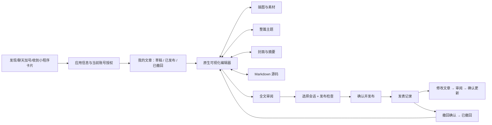
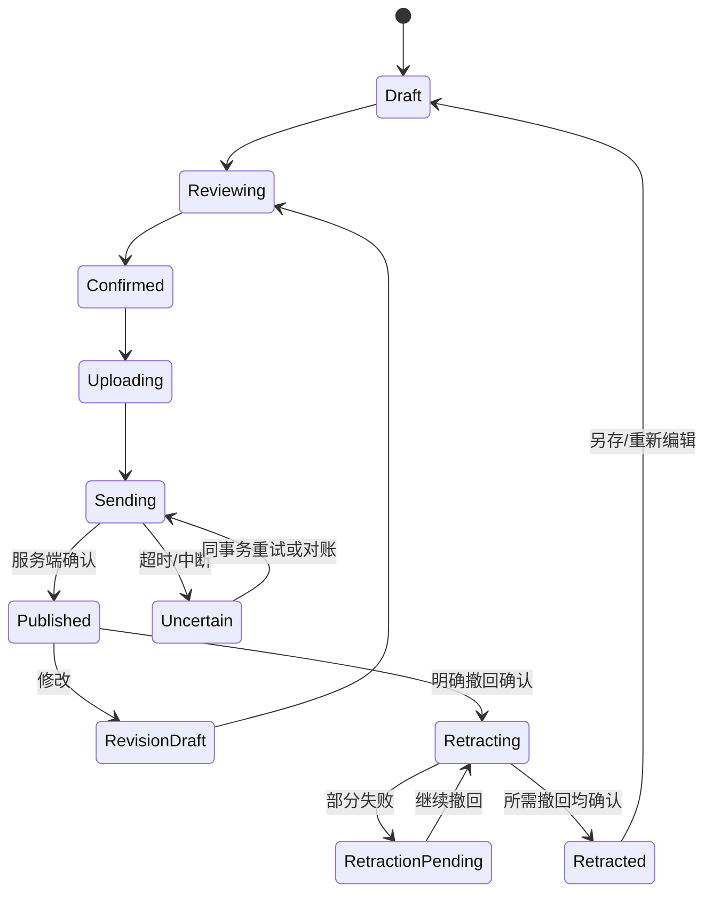

# 图文创作小程序 v2：产品、界面与实现计划

状态：已完成 gpt-image-2 UX 生图、12 场景测量裁切和原生 v2 实现。实际完成范围、验证证据与未验收项见 [README](README.md)；以下保留完整产品规划，不把规划中的后续增强记为已实现。

工作分支：`wechat-ui`。不合并 `main`。延续原生 Makepad、Octoscript 小程序入口、Markdown/HTML 渲染、中文/英文和 Apple 平台 PingFang；不用 WebView。

## 1. 产品目标与边界

把现在“标题 + Markdown 输入 + 预览”的工具升级为完整的图文工作室：可以直接在排版后的文章上写作，管理插图与封面，切换整篇文章主题，阅读全文，发布到自己选择的 Matrix 会话，并管理修改和撤回。

这里借鉴微信公众号的创作体验；实际发布目标仍是 Robrix/Matrix，不接入微信公众平台账号或群发接口。分享小程序与分享文章是两个独立操作：前者让接收者用自己的账号打开空白/自己的草稿，后者发送作者已确认的文章。

“full review”同时包含全文阅读预览和发布前检查。检查是确定性的内容/权限检查，不冒充人工审稿或 AI 审核。

## 2. 六项要求对应的完整交互

| 要求 | 用户看到的行为 | 必须连接的逻辑 |
| --- | --- | --- |
| 所见即所得 | 默认直接编辑排版后的标题、段落、列表、引用；选择文字后加粗/斜体/链接；图片在正文原位出现 | 结构化文档、原生富文本输入、选区与中文输入法、撤销/重做；编辑/预览共用排版参数 |
| 插图 | 正文中“＋”→ 图片 → 系统选择器/本篇素材；可改图注、替代文字、宽度、排列位置或移除 | 受控本地素材副本、格式/尺寸检查、上传进度、失败重试、Matrix 媒体加密/下载 |
| theme | “样式”展示四种有真实预览的整篇主题，一点即应用且不修改正文 | 固定主题 ID、标题层级/正文/引用/间距/背景参数，保存与接收端阅读一致 |
| 封面插图 | 独立“封面与摘要”页面；选图、调整焦点、宽封面与方形缩略图预览、摘要 | 封面与正文图片独立；非破坏裁剪；发布卡片和全文头图引用一致 |
| full review | 无编辑控件的完整文章、手机/宽屏预览、目录跳转、字数/阅读时间、图文检查 | 与发表内容相同的文档快照；缺图/空标题/超长/失效授权阻止发表；返回保留位置 |
| 发布、修改、撤回 | 指定会话、最终确认、明确成功/待确认状态；已发布列表中修改、撤回、重新编辑 | 持久化发表记录与事务；Matrix 原事件 + replacement；撤回原文及修订事件；保留本地草稿 |

不能把“左右两个框，其中一边是 Markdown，一边是预览”称为所见即所得。Markdown 是明确标注的高级源码模式，可视化模式不展示 `**`、`##` 等源标记。

## 3. 信息架构

## 4. 页面与视觉规格

统一视觉：微信风格的浅灰导航区、白色纸面、绿色主操作、细线图标与克制的分隔。正文以阅读舒适为先；主题只改变文章，不把编辑器操作控件染成不同品牌。

移动参考尺寸 430 × 860 pt，验收另测 390 × 844；桌面参考尺寸 1440 × 960。移动端控件点击区域至少 44 pt，返回箭头图形约 8 × 14 pt，避免此前过大的返回和加号。输入法弹起时，格式工具栏在键盘上方且不挡住光标。

### 01 我的文章

- 顶栏：小返回、图文创作、更多；“新建文章”为清楚的主操作。
- 分栏：草稿 / 已发布 / 已撤回；搜索按标题、摘要过滤。
- 每行：封面缩略图、标题、摘要、保存时间、状态；已发布项显示目标会话和版本。
- 多篇草稿分别保存；重开应用不只剩最后一篇。空列表有明确新建入口。
- 分享小程序放在更多菜单；不混入文章发布按钮。

### 02 可视化编辑

- 顶栏：返回、当前标题/“未命名文章”、保存状态、全文预览。
- 正文画布：标题、作者、摘要、正文块；空白画布直接点入写作。
- 选中文字后浮动工具：加粗、斜体、链接、清除格式；块工具：正文/H2/H3、引用、有序/无序列表、分隔线。
- 图片块有选择框与图注；块菜单支持上移、下移、删除。首尾移动按钮不可点击。
- 底部工具：文字、图片、样式、封面、更多；更多包含 Markdown、撤销、重做。
- 自动保存有“保存中/已保存/保存失败”，保存失败不隐藏。离开前保留草稿；不能静默丢失输入。

### 03 插图选择与 04 图片设置

- 系统图片选择器使用已有 Robius 文件选择机制，取消保持文档原样。
- 本篇素材网格与“从设备选择”，选图后立即显示本地预览；此时不上传。
- 图片设置提供替换、图注、替代文字、100%/75%/50% 宽度与居中；正文顺序可调整。
- 首批接受静态 JPEG/PNG，显示实际支持格式与大小限制，不提供无效的格式按钮。
- 解码前限制文件大小，解码时限制像素，验证真实编码，处理方向；导出副本不带定位元数据。
- 处理失败有重试/移除，缺失素材明确报错，不能用占位图冒充真实插图。

### 05 文章主题

四个内置主题：经典绿、书页暖白、海盐蓝、极简墨色。每张主题卡包含标题、正文、引用和小图的真实缩略样例；选中项有勾选。字号提供标准/大字两档，行距提供舒适/紧凑；只暴露原生渲染确实支持的选项。

主题更换保留文字、选区与图片，进入撤销栈。原生读者使用同一主题；其他 Matrix 客户端读取兼容的标准 HTML 与纯文本，不能承诺所有客户端显示完全相同的视觉效果。

### 06 封面与摘要

- 独立上传/选择封面，不强制把正文第一张图当封面。
- 宽封面 2.35:1 与方形 1:1 双预览；这里是产品设计选择，不宣称是微信所有场景的唯一规格。
- 拖动焦点/缩放时两个预览同步，保留原图并保存裁剪参数。
- 标题、作者、摘要编辑与字数提示；“在全文顶部显示封面”开关。
- 没有封面允许保存草稿；发布检查提醒并可明确选择无封面，不伪造图片。

### 07 全文审阅

- 完整可滚动文章：封面、标题、作者、正文、图片和图注，不截断为摘要。
- 顶部仅返回编辑、预览尺寸；底部“发布检查”。桌面可切换手机宽度/宽屏。
- 阅读进度与段落目录；切换主题、预览宽度和返回编辑后保留阅读位置。
- 字数/阅读时间按本地可解释规则计算，图片显示实际内容。

### 08 发布检查与 09 最终确认

- 检查标题、有效正文、媒体可读、尺寸/事件体积、授权、房间成员资格与发送权限。
- 搜索加入的会话，沿用按名称搜索；不要求用户输入 Matrix URI。
- 最终页面展示当前账号、目标会话、封面卡片、文章标题、版本、图片数和操作类型。
- 确认后才上传图片并发送文章；提供逐项进度。网络结果不明显示“待确认”，不会谎称失败并生成新事务。
- 返回编辑会使旧确认失效。重复点击与重试使用同一事务；变更收件会话需要重新审阅确认。

### 10 发表记录与 11 修改文章

- 发表记录显示目标会话、发表时间、最近修订时间、版本与状态。
- 修改先创建工作副本，原文在读者端保持当前版本；“保存草稿”不会更新公开内容。
- 修改后再次全文审阅和确认；发送引用原 event ID 的 `m.replace`，保留文章身份。
- 确认页说明“更新到版本 N”，展示已变更的标题、正文、图片、主题、封面项目。
- 发现其他设备的新修订时先同步并提示冲突；不得直接覆盖无法识别的更改。

### 12 撤回与重新编辑

- 二次确认显示文章和目标会话，提示“撤回后此会话不再展示文章；已下载或另行转发的副本无法收回”。
- 撤回原事件与本应用已知修订，并查询/核验服务端修订关系；任一步失败显示部分完成，允许按同一任务重试。
- 只有服务端结果确认后显示已撤回；本地草稿保留。重新编辑/再发布创建新的发表记录，不假装恢复旧事件。
- 不对外承诺撤回会物理删除所有服务器副本或所有图片媒体。

## 5. 桌面布局

宽屏采用三栏：左侧 220 pt 文章库与目录，中间约 660 pt 可滚动纸面，右侧 280 pt 属性面板（图片/样式/封面）。顶部固定保存状态、审阅和发表入口。正文有合理最大宽度，不随窗口无限拉宽。

窄于约 960 pt 时侧栏改为抽屉；手机单画布 + 底部工具 + 全屏属性页。所有窗口宽度共用同一个文档与撤销历史，不维护两套逻辑。

## 6. 原生实现与数据模型

### 文档是唯一真实数据

`ArticleDocument` 包含稳定 ID、schema version、标题、作者、摘要、主题、封面、正文块与文档 revision。每个块有稳定 ID，类型为 Paragraph / Heading / Quote / List / Image / Divider；文字由文本与有界格式区间组成。素材只引用本应用导入的 asset ID，不接受任意本地路径。

Markdown 是可导入/导出的表示。切换源码前生成 Markdown；返回可视化时先解析、校验并给出不支持语法的位置，不能悄悄删除数据。主题、裁剪、作者等不属于标准 Markdown 的数据单独保存。兼容读取 v1 `draft.json`，首次迁移成功前保留旧文件。

### 原生所见即所得

当前固定版本的 Makepad `Html` 是渲染控件，`TextInput` 是文本输入控件；不能把 Html 本身当可编辑浏览器 DOM。需要文章块层和格式区间感知的原生输入/绘制适配，共用排版测量、光标映射和选择区，而不是覆盖一张不可编辑的截图。

先通过原型验证中文 IME、emoji/组合字符、跨行选区、加粗范围、撤销和移动端键盘；这些通过后才复用到整篇编辑器。选择区偏移统一使用明确的 UTF-8 边界，样式范围随编辑变化。严禁在输入法正在组合时重新 `set_text` 导致候选词丢失。

### 图片与阅读器

本地素材按账号/应用/文档保存受控副本与元数据。发布时上传不可变快照中的素材；对加密会话必须使用加密媒体描述，不把明文上传当作加密完成。HTML 内容走严格白名单；只允许宿主已解析的受控图片引用，不允许页面加载任意外网跟踪图或执行脚本。

Makepad Html 中的图片通过受控原生图片组件解析；封面卡片、全文阅读、编辑预览共用素材解析与主题。接收方只通过自己的 Matrix SDK 权限获取图片，不继承发送方令牌。

发布保留标准 `m.room.message` 文本/HTML 回退，并附带命名空间内的文章版本、主题和媒体元数据。实际发送采用 SDK 支持的原始内容通道，以免通用 Rust 内容反序列化丢弃未知字段；接收端在使用这些元数据前做版本、尺寸、类型校验。

### 发表与撤回状态机

本地持久化 `Publication`（账号、文档、room ID、root event ID、revision event IDs、版本、状态）及 `OutboxOperation`（不可变文档快照、事务 ID、上传结果、已确认 event IDs）。重启不能丢失不确定的发送任务；同一发表目标的修改/撤回串行处理。

服务端权限、当前账号、会话加入状态、grant 有效性必须在异步等待后和发送前重验。撤回还要核验目标事件发送者与可撤回权限。小程序代码不接触 Matrix 登录令牌或 OpenAI 密钥。

## 7. 图片到原生界面的交付顺序

1. 固定本计划、双语文案、12 个状态与公共示例内容。
2. 用明确指定的 `gpt-image-2` 生成一张 12 状态 UX 图集（3840 × 2160，高质量）和一张桌面编辑界面（1536 × 1024，高质量）。保存原始输出、原始 prompt、实际尺寸、模型参数与文件哈希。
3. 人工检查文字可读性、操作顺序、一致性；按真实像素测量裁切。调用已有 Octoscript-AppCard `image-to-appcard-flow` 的 intake/prepare，不能把预设坐标冒充实际测量结果。
4. 将每个区域映射为原生 Label / TextInput / Html / Image / Button / View / PortalList；只有插画/照片使用 raster。按钮必须对应状态机动作，不能以热区截图代替 UI。
5. 实现原生编辑器、素材、主题、封面、阅读器；接入草稿与 Matrix 发表管理。更新 Octoscript 包版本与权限描述，明确旧卡兼容策略。
6. 原生测试双账号 Palpo 的完整阅读/修改/撤回流程；保存实际截图、结构和操作证据。视觉评分与功能测试分别记录，没有评分前不声称 9/10。

生图已完成：使用 imagegen 技能 CLI 显式指定 `gpt-image-2`，两张图片的实际尺寸、原始提示词和 SHA-256 已记录在 `generation-request.json`。凭据未写入仓库、命令参数、提示词或生成物。上游 `intake,prepare` 已通过；Robrix 原生适配映射见 `NATIVE-MAPPING.md`。

## 8. 验收矩阵

| 范围 | 必须验证 |
| --- | --- |
| 编辑 | 中英文输入法、选择格式、图片原位编辑、跨行操作、撤销/重做、复制粘贴、长文章、窄屏与键盘 |
| 文档 | v1 草稿迁移、多草稿隔离、原子保存、保存失败、重启恢复、Markdown 往返、超限输入 |
| 图片 | 真实格式/尺寸限制、方向、损坏文件、取消选择、图注、位置、封面裁剪、缺失资源 |
| 主题 | 四主题在编辑/预览/接收端一致，切换不改正文，其他客户端回退可读 |
| 发布 | 真正的确认后上传、选择正确会话、双击只产生一次发表、失败同事务重试、重启待确认恢复 |
| 修改 | 原 event ID 不变、revision 正确、接收方看到更新、其他设备冲突、权限变更 |
| 撤回 | 原文与修订处理、部分失败继续、接收方不再显示、本地草稿保留、无法回收副本提示 |
| 授权 | 分享不含凭据/草稿/grant，接收者重新授权，退出/到期/换账号中止；媒体同样隔离 |
| 视觉 | 390/430 pt 手机、宽屏、中文/英文、无截字/遮挡、真实截图与生成参考逐页比较 |

实施完成以这些可复查证据为准。此计划没有把未执行的测试或未生成的图片记为通过。
