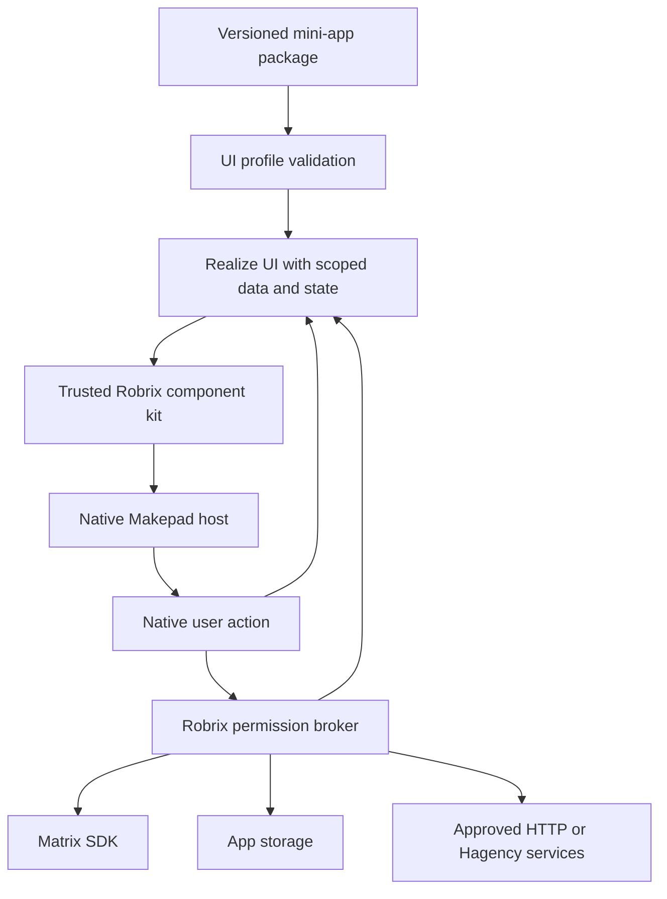

# Octoscript mini apps in Robrix

Reviewed 2026-09-20 (America/Los_Angeles). This is a source review and proposed
integration, not a runtime implementation or a visual acceptance result.

Follow-up: [ADR 0002](../../docs/adr/0002-octoscript-mini-app-authority.md)
reviews OctoSense ROM, app admission and the published Splash policy patches,
and specifies launch-time account delegation for a Markdown/HTML post editor.

## Recommendation

Yes. Use Octoscript for native mini-app UI and reuse the A2App approach for
installation, permissions, lifecycle and Matrix sharing. Start with
`octoscript-ui-l0`, whose checker and state realization do not depend on a
Makepad VM. Adapt its output to Robrix's native Makepad host. Add the separate
Octoscript workflow runtime only when an app needs procedural tool workflows
and its dependencies have been reconciled.

Splash and Octoscript are not interchangeable package formats. Splash is the
embedded native UI host in the reviewed A2App revision. The Octoscript project
provides multiple profiles, including declarative UI and bounded workflows.
The standalone workflow CLI does not render a Makepad application.

Keep HTTP(S) mini apps available through the current native WebView. Both
types can use **Discover → Mini Apps**, the chat **+ → Mini App** picker and
shareable chat cards. Open native apps in a page with Back and Share, keeping
the four primary tabs.

## Sources checked

| Source | Revision |
| --- | --- |
| [A2App](https://github.com/a2app/robrix_a2app/tree/3cfc70e14051a7a027e47cb5b556ef84cd23cb7a) | `a2app` branch, `3cfc70e14051a7a027e47cb5b556ef84cd23cb7a` |
| [Octoscript](https://github.com/OctoSense-org/Octoscript/tree/86a51a30767da5bf1f2e87559730f8539300b5d0) | `main`, `86a51a30767da5bf1f2e87559730f8539300b5d0` |
| [Octoscript-AppCard](https://github.com/OctoSense-org/Octoscript-AppCard/tree/e84cf114db1fe50db6d6325a1c91cbacc14e5d57) | `main`, `e84cf114db1fe50db6d6325a1c91cbacc14e5d57` |

The newer A2App commit mentions **Octos** for agent generation. That does not
establish that its mini-app runtime uses **Octoscript**. The inspected native
runtime still creates a `Splash` widget and evaluates manifest source.

## What A2App actually does

1. **Package:** a `.splashapp` is versioned JSON containing metadata, declared
   permissions and Splash source, with an optional smaller widget source.
   Export omits the user's actual permission grants and local room association.
   Import also accepts bare Splash source.
   See [bundle.rs](https://github.com/a2app/robrix_a2app/blob/3cfc70e14051a7a027e47cb5b556ef84cd23cb7a/a2app/core/src/bundle.rs).
2. **Host:** an app/room instance owns a native host widget and VM isolate.
   Before evaluating source, it configures storage, capability grants and
   information-flow context. It calls `set_host_io_only(true)` and
   `set_allow_net(false)`, then `set_text` with the app source.
   See [instances.rs](https://github.com/a2app/robrix_a2app/blob/3cfc70e14051a7a027e47cb5b556ef84cd23cb7a/src/a2app/instances.rs).
3. **Services:** scripts issue `host.request("matrix.*", ...)`. The host broker
   validates and authorizes requests; Rust adapters perform the Matrix SDK
   operations. Examples include room information, recent messages, sending,
   replies, reactions and room search. An app's permission declaration is not
   an authorization grant.
   See [service parsing](https://github.com/a2app/robrix_a2app/blob/3cfc70e14051a7a027e47cb5b556ef84cd23cb7a/a2app/core/src/services/matrix.rs)
   and [SDK adapter](https://github.com/a2app/robrix_a2app/blob/3cfc70e14051a7a027e47cb5b556ef84cd23cb7a/src/a2app/matrix/mod.rs).
4. **Share:** a custom `rs.robius.a2app` Matrix event carries the bundle. Its
   timeline card offers installation or running the matching installed app.
   Rendering the received preview does not evaluate its app source.
   See [timeline_card.rs](https://github.com/a2app/robrix_a2app/blob/3cfc70e14051a7a027e47cb5b556ef84cd23cb7a/src/a2app/timeline_card.rs).

## Proposed Octoscript adapter

The reusable UI crate supplies `check_ui_l0`, `realize_with_state`, an
`InstanceStore`, dispatch and `kit::lower`. It depends on `serde_json` and
`blake3`, without a VM dependency. L0 admits declarative components, bindings
and local state; explicitly declared L1 adds pure arithmetic. Full imperative
UI source requires a different profile. Hosts still need collection, node and
depth limits and must authorize data sources and effectful actions.
See [UI implementation](https://github.com/OctoSense-org/Octoscript/blob/86a51a30767da5bf1f2e87559730f8539300b5d0/crates/octoscript-ui-l0/src/lib.rs).

AppCard already implements a useful reference loop: native action notification
→ state dispatch → realization → theme-kit lowering → evaluation and widget
construction → redraw. Its kits and native data providers need adaptation to
Robrix; their presence does not grant access to Robrix accounts or rooms.
See [l0_card.rs](https://github.com/OctoSense-org/Octoscript-AppCard/blob/e84cf114db1fe50db6d6325a1c91cbacc14e5d57/app/app/src/app/l0_card.rs).

For optional workflow logic, register reviewed tools in Octoscript's `mod.tool`
bridge and route them to the same Robrix broker. The existing Octoscript
`tool.start_json` interface can represent asynchronous operations; the mapping
to Robrix's services must be implemented. Neither L0 declarations nor workflow
tool names should expose Matrix tokens or bypass permission and room checks.
An embedded, host-pumped workflow path is appropriate for mobile once its VM
dependencies are reconciled; a desktop subprocess is not an iOS solution.

The image-to-appcard-flow pipeline can author and measure the UI that goes
into these packages. It produces native UI mappings and connects authored
service state/actions; it does not infer Matrix business logic from screenshots
or provide the installation and permission system. Its native and visual
acceptance stages remain separate.
See [flow pipeline](https://github.com/OctoSense-org/Octoscript-AppCard/blob/e84cf114db1fe50db6d6325a1c91cbacc14e5d57/lab/image-to-appcard-flow/README.md).

## Compatibility work before integration

| Boundary | Required work |
| --- | --- |
| Makepad revision | Robrix uses `47837267faf6970a6cc36acedf9f83846b277307`; A2App uses `a8a210f20822936d502727a8295fb06217609a6b`. Robrix's pinned Splash lacks `set_host_io_only`. Reconcile the host APIs and preserve the I/O restriction before evaluating imported executable source. |
| UI versus workflow runtime | Octoscript documents parser compatibility with hosted Makepad UI, not standalone CLI rendering. Its core carries a different Makepad VM lineage. Start with the independent L0 crate; do not add a second widget/VM dependency graph blindly. |
| Bundle format | Add an explicit runtime/profile and version. Existing arbitrary Splash source is not automatically valid L0 or canonical workflow source. Reject unsupported profiles; keep legacy Splash support separate if needed. |
| Data and state | Scope app instances and storage to account/app/room; cancel work and clear handles on logout or revocation. Native source bindings must resolve only through approved host adapters. |
| Chat interoperability | Preserve existing web-card parsing. Add a native bundle renderer, forwarding behavior and fallback text/file representation. Ordinary Matrix clients need not render A2App custom events. |
| Host UI | Apply Chinese/English copy and PingFang through the mini-app kit and host chrome. A separate UI VM does not establish font or locale inheritance. |
| Hagency | Expose only specific reviewed operations through the existing guards. Mini-app installation must not enable development-gated Hagency operations. |

Both reviewed applications resolve Matrix SDK to
`6892cb217ae4a886571e928c8efcccfbec5490a6`; the Makepad boundary is the immediate
dependency mismatch. See also Octoscript's explicit
[UI compatibility limits](https://github.com/OctoSense-org/Octoscript/blob/86a51a30767da5bf1f2e87559730f8539300b5d0/docs/makepad-ui-compatibility.md).

## First implementation slice

Build one bilingual room task/checklist app: import → preview → open → native
state edit → approve sending its summary to the attached room → share the app
card → install and open from a second fixture account. This exercises the UI,
state, Matrix adapter and package lifecycle without requiring AI generation.

Acceptance should cover denied/revoked permissions, malformed/unsupported
packages, room/account isolation, offline restore, Back navigation, forwarding,
and native clicks in both languages. Use isolated fixture profiles and native
instrumentation, followed by macOS and physical iOS validation. A passing
parser test would not establish rendered UX or a 9/10 WeChat similarity score.

Current Robrix implements only the shareable HTTP(S) path in
[`src/mini_app.rs`](../../src/mini_app.rs). This review changed no dependencies
or runtime code and did not execute A2App or an Octoscript mini app in Robrix.
